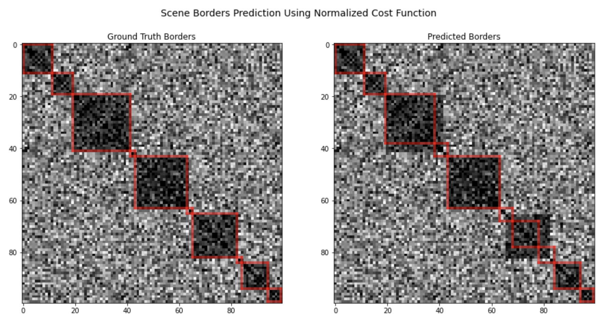

# Video Scene Detection Based on the Optimal Sequential Grouping algorithm

Video scene detection is the task of temporally dividing a video into semantic scenes. This repository implements two video scene detection algorithms from the following papers:

- Robust and Efficient Video Scene Detection Using Optimal Sequential Grouping [https://ieeexplore.ieee.org/abstract/document/7823628]
- Optimally Grouped Deep Features Using Normalized Cost for Video Scene Detection [https://dl.acm.org/doi/10.1145/3206025.3206055]

To accomplish the video scene detection task the next few steps have been proposed in the papers:
- divide a video into shots (sequences of frames from one editing cut to another)
- extract an arbitrary set of features from each shot
- find pairwise distances between feature vectors
- split shots into non-intersecting groups by optimizing a distance-based cost function

The resulting groups of shots represent the desired scenes.

The core idea is to solve the problem as an optimization process of sequential grouping task.

To group shots optimally, one has to solve a sequential grouping task. Two different cost functions are introduced in the papers:
- A simple one, called H_add, calculates the cost as a sum of the distances between each group's shots.
- The more sophisticated one, called H_nrm, extends H_add by normalizing the sum of the distances within each of the groups by the size of the group.
Improved solutions for both cost functions are introduced in this repository.

The repository has been created to demonstrate the application of the algorithms on synthetic data. It doesn't contain code that extracts shot features and calculates pairwise distances.
